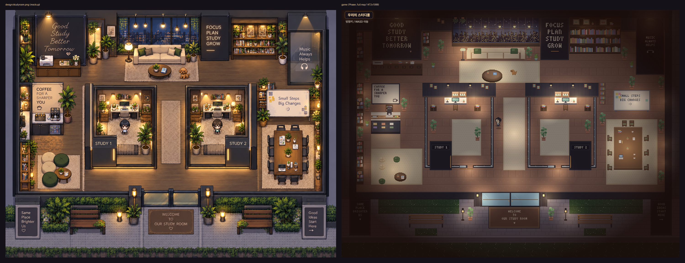

# 📚 Null Study Meta

2D 탑뷰 멀티플레이 **스터디 메타버스**. 밤의 아늑한 스터디 카페 "우리의 스터디룸"에서 같이 공부하는 공간을 만듭니다.

> **현재 단계: 1단계 — 뼈대와 비주얼.** 혼자 접속해서 캐릭터 하나가 방을 걸어다니는 것까지 (벽·가구·유리벽 충돌).
> 서버는 정적 파일 서빙 + `/healthz` + 방 데이터 JSON 뿐이고, 소켓(멀티플레이)은 다음 단계에서 붙습니다.



## 기술 스택

| 영역 | 사용 기술 |
|---|---|
| 런타임 | Node.js 24 (`.node-version`), 최소 22 (`engines`) |
| 서버 | Express (정적 파일 + `/healthz` + `/api/rooms/studyroom`), Socket.io 는 다음 단계 |
| 클라이언트 | Phaser 3.87 (CDN), 순수 HTML/CSS/JS — **빌드 도구 없음** |
| 저장소 | Supabase (`SUPABASE_URL` + `SUPABASE_SERVICE_KEY`), 키가 없으면 **메모리 저장소로 자동 폴백** |
| 에셋 도구 | Python 3 + Pillow (아틀라스/캐릭터 빌드, 리컬러). 빌드 결과물은 커밋되므로 실행 시에는 필요 없음 |

## 폴더 구조

```
null-study-meta/
├── CLAUDE.md                 # 작업 규칙 (스택 고정, 테스트는 STORE=memory 강제, 에셋 라이선스 등)
├── package.json              # start / dev / test / build:assets
├── .node-version             # 24
├── .env.example              # 환경변수 템플릿 (.env 로 복사)
├── render.yaml               # Render free 플랜 Blueprint (NODE_VERSION=24, healthCheck /healthz)
├── design/studyroom.png      # 목업 (방 배치·색감 기준)
├── server/
│   ├── index.js              # Express 부트스트랩, /healthz, /api/rooms/studyroom
│   ├── rooms/
│   │   ├── build.js          # RoomBuilder: tiles.json 기준으로 레이어 배열 + 충돌/의자/문/조명 생성, 판정 함수
│   │   └── studyroom.js      # "우리의 스터디룸" 46x34 타일 정의
│   └── store/                # index.js(선택/폴백), memory.js, supabase.js
├── public/
│   ├── index.html, css/style.css
│   ├── js/main.js            # 방·아틀라스·아바타 메타 fetch → Phaser 게임 생성
│   ├── js/scenes/RoomScene.js# 타일맵 3레이어, 이동/충돌, 카메라 추적, 조명 마스크·글로우·비네팅, 창밖 불빛 깜빡임
│   └── assets/               # tiles.png / tiles.json (아틀라스), player.png / player.json, CREDITS.txt
├── tools/
│   ├── fetch_assets.py       # 외부 에셋 원본 다운로드 → tools/raw/ (git 제외)
│   ├── build_assets.py       # 아틀라스 + 캐릭터 시트 빌드 (16px 논리 → 32px, nearest)
│   ├── recolor.py            # 팔레트 리컬러 (Kenney 원색 → 목업의 따뜻한 파스텔/우드 톤)
│   ├── pixel.py              # 픽셀 드로잉 도우미 + 3x5 픽셀 폰트
│   ├── props.py, props_room.py # 팩에 없는 소품을 코드로 그림 (창문, 네온/보드, 소파, 유리벽, 커피머신, 벤치 …)
│   ├── render_map.py         # 서버 방 데이터를 PNG 로 합성 (배치/충돌 검수)
│   └── screenshot.js         # puppeteer-core 로 게임 스크린샷 (spawn / walk / 전체 맵)
├── test/                     # node:test — setup.js 가 STORE=memory 강제
└── screenshots/compare.png   # 목업 vs 게임 비교
```

## 로컬 실행

```bash
npm install          # Node 22+ (권장 24)
npm start            # http://localhost:3000  (개발 중 자동 재시작: npm run dev)
```

- 조작: **방향키 / WASD** 로 이동. 벽·가구·유리벽·식물 화분은 통과 불가, 유리 스터디룸은 미닫이문으로만 출입.
- 캔버스는 960×540 논리 해상도를 비율 유지(`Scale.FIT`)로 화면에 채우고, 카메라가 내 아바타를 따라갑니다. `pixelArt: true`.
- 다른 포트: `PORT=8080 npm start` (PowerShell: `$env:PORT=8080; npm start`).

### 테스트

```bash
npm test
```

`test/setup.js` 가 테스트 프로세스에 `STORE=memory` 를 강제하고 `SUPABASE_*` 를 제거하므로 **실제 Supabase 로 절대 나가지 않습니다.**
검사 항목: 저장소 선택/폴백, 방 크기·레이어·타일 인덱스, 벽/유리벽 충돌, 좌석 18개·문·입구 통과 가능,
스폰에서 모든 좌석·문·바깥까지 BFS 도달, 상단 레이어 칸 통과 가능, 서버 `/healthz`·정적 파일·방 JSON.

## 방 데이터 형식 (`GET /api/rooms/studyroom`)

```jsonc
{
  "id": "studyroom", "name": "우리의 스터디룸", "width": 46, "height": 34, "tileSize": 32,
  "layers": { "floor": [[...]], "furniture": [[...]], "top": [[...]] },  // 아틀라스 타일 인덱스, 빈 칸 -1
  "collision": [[true, false, ...]],
  "seats": [{ "id": "seat-0", "x": 19, "y": 6, "facing": "down", "kind": "sofa_wide" }],
  "doors": [{ "id": "study1-l", "x": 16, "y": 21, "to": null }],
  "lights": [{ "x": 560, "y": 77, "r": 83, "color": 16758876, "intensity": 0.55 }],  // 픽셀 좌표
  "spawn": { "x": 720, "y": 768 }
}
```

- `server/rooms/studyroom.js` 는 `RoomBuilder` 로 오브젝트를 타일 좌표에 놓기만 하고, 레이어 배열·충돌·좌석·문은
  `public/assets/tiles.json` 의 오브젝트 정의(크기, `layer`, `solid`, `top` 행 수, `seats`, `door`)에서 자동으로 만들어집니다.
- 화분 윗부분, 스탠드 램프 갓, 가로등 머리, 창가 덩굴처럼 **아바타 앞에 와야 하는 것은 `top` 레이어**(통과 가능)로 갑니다.
- 클라이언트는 이 배열을 그대로 Phaser 타일맵 3개 레이어로 그립니다 (클라이언트에 맵 하드코딩 없음).

## 비주얼

- **색감**: 따뜻한 원목 바닥, 어두운 차콜 벽, 앰버 조명, 짙은 초록 식물. Kenney 팩의 채도 높은 주황/초록은 `tools/recolor.py` 로 변환.
- **조명**: 맵 크기의 RenderTexture 를 어둡게 채운 뒤 조명 위치마다 방사형 그라데이션으로 지우고(라이트 마스크),
  그 위에 앰버 글로우(가산 합성, 천천히 흔들림)와 화면 고정 비네팅을 올립니다. 조명 위치는 방 데이터의 `lights`.
- **창문**: 야경 그라데이션 + 건물 실루엣 + 창 불빛 2프레임을 타일 인덱스 교체로 무작위 깜빡임. 펜던트 5개는 창문 타일에 포함.

## 에셋

원본은 `tools/raw/` (git 제외)에 두고, 가공본만 `public/assets/` 에 둡니다. 출처·제작자·라이선스는
[`public/assets/CREDITS.txt`](public/assets/CREDITS.txt).

| 용도 | 에셋 | 라이선스 |
|---|---|---|
| 의자·카운터·액자·작은 화분 | Kenney *Roguelike Indoors* | CC0 |
| 캐릭터(치비 16×32, 4방향 4프레임 걷기) | ArMM1998 *Zelda-like tilesets and sprites* (OpenGameArt) | CC0 |
| 나머지 대부분 (바닥·벽·창문·보드·소파·유리벽·커피머신·벤치 …) | 이 저장소에서 코드로 그린 오리지널 | 프로젝트 라이선스 |

다시 빌드하려면 (Python 3.9+, Pillow):

```bash
python tools/fetch_assets.py     # 원본 다운로드
python tools/build_assets.py     # public/assets/tiles.png, tiles.json, player.png, player.json
```

## 환경변수

| 이름 | 기본값 | 설명 |
|---|---|---|
| `PORT` | `3000` | HTTP 포트 (Render 가 자동 주입) |
| `STORE` | (자동) | `memory` 또는 `supabase`. 비워두면 Supabase 키가 있을 때 `supabase`, 없으면 `memory` |
| `SUPABASE_URL` | – | Supabase 프로젝트 URL |
| `SUPABASE_SERVICE_KEY` | – | Supabase **service_role** 키 (서버 전용, 클라이언트 노출 금지) |

## Render 배포 (Free)

`render.yaml` 이 있어 **New + → Blueprint** 로 배포합니다. `NODE_VERSION=24`, `healthCheckPath: /healthz`,
`SUPABASE_URL` / `SUPABASE_SERVICE_KEY` 는 `sync: false` 라 대시보드에서 입력합니다 (지금 안 넣으면 메모리 저장소로 동작).
Free 플랜은 15분 무요청 시 잠들고, 재시작 시 메모리 상태가 초기화됩니다.

## 다음 단계

- Socket.io 로 입장/이동 동기화, 닉네임, 채팅
- 의자·푸프·소파 앉기(`seats`), 유리문/입구 `doors` 로 방 이동, 실외 연결
- Supabase 스키마와 공부 시간 기록
