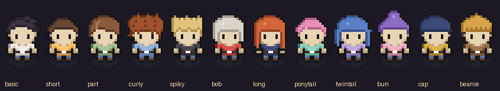
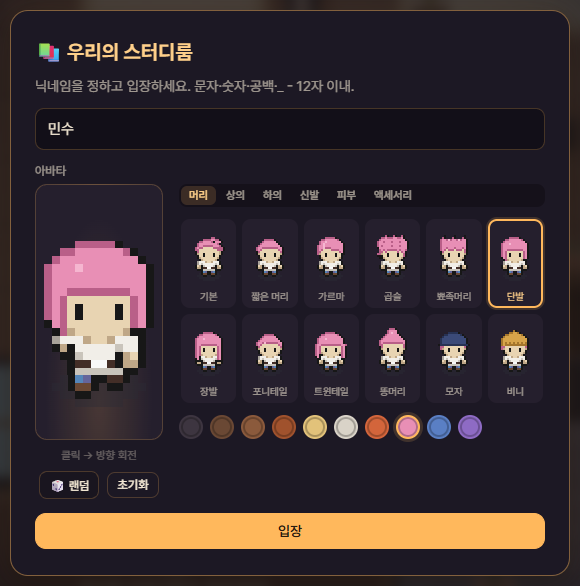
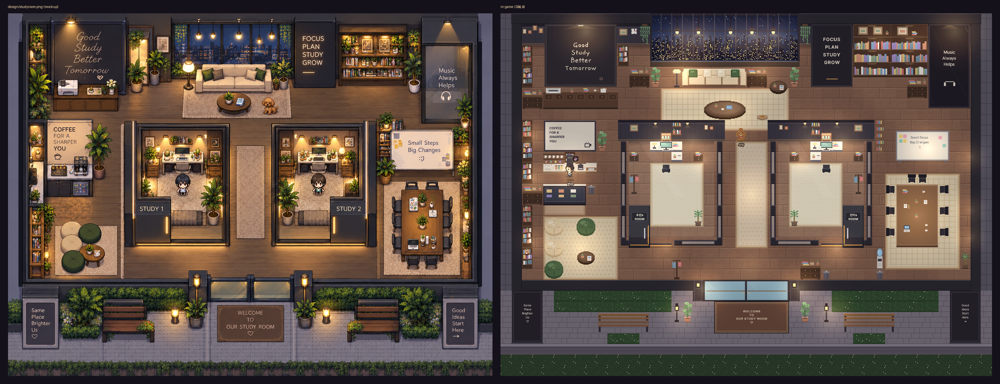
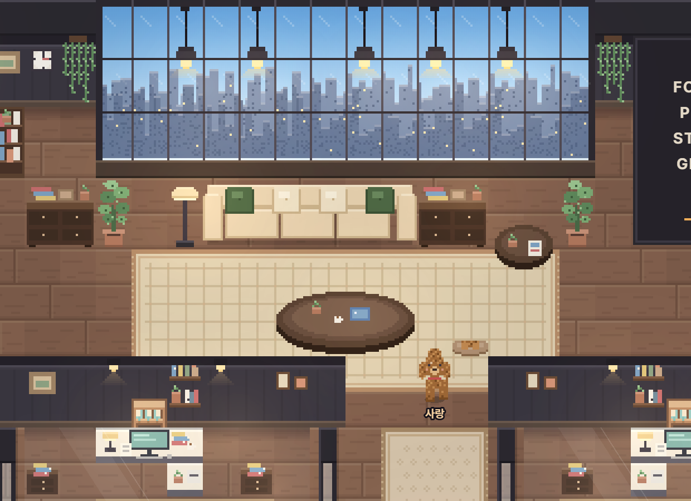
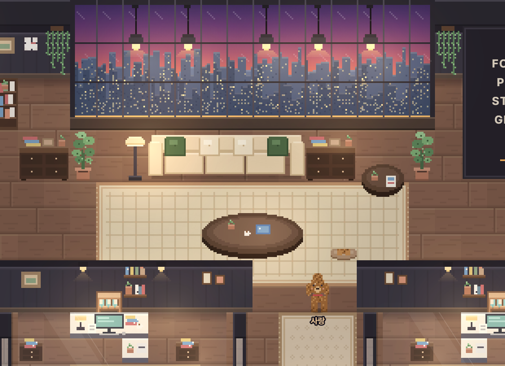
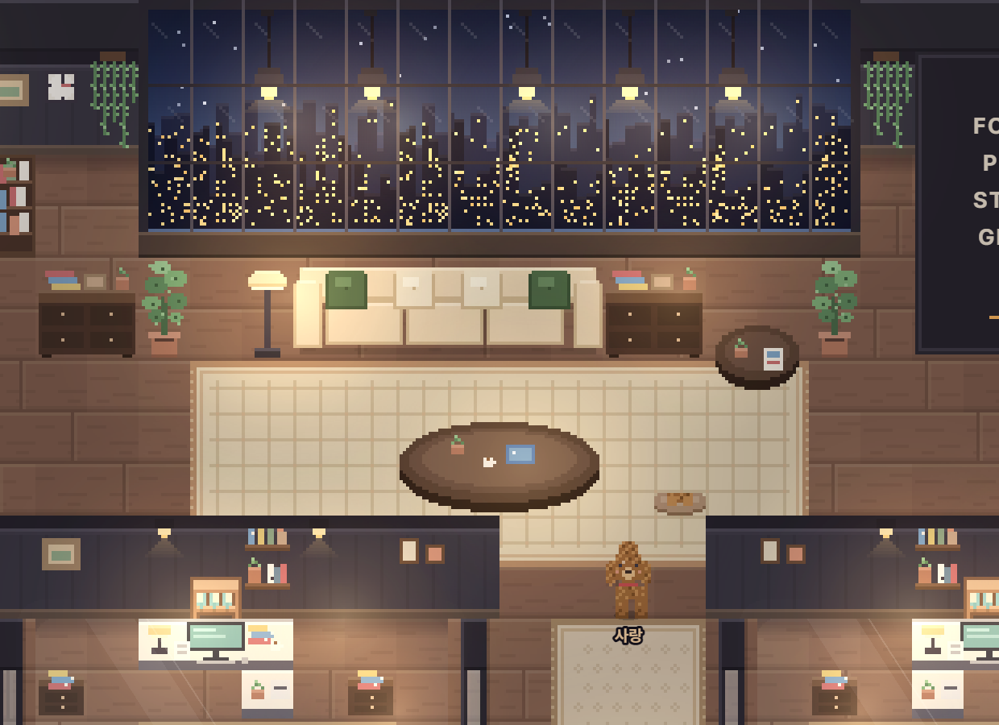
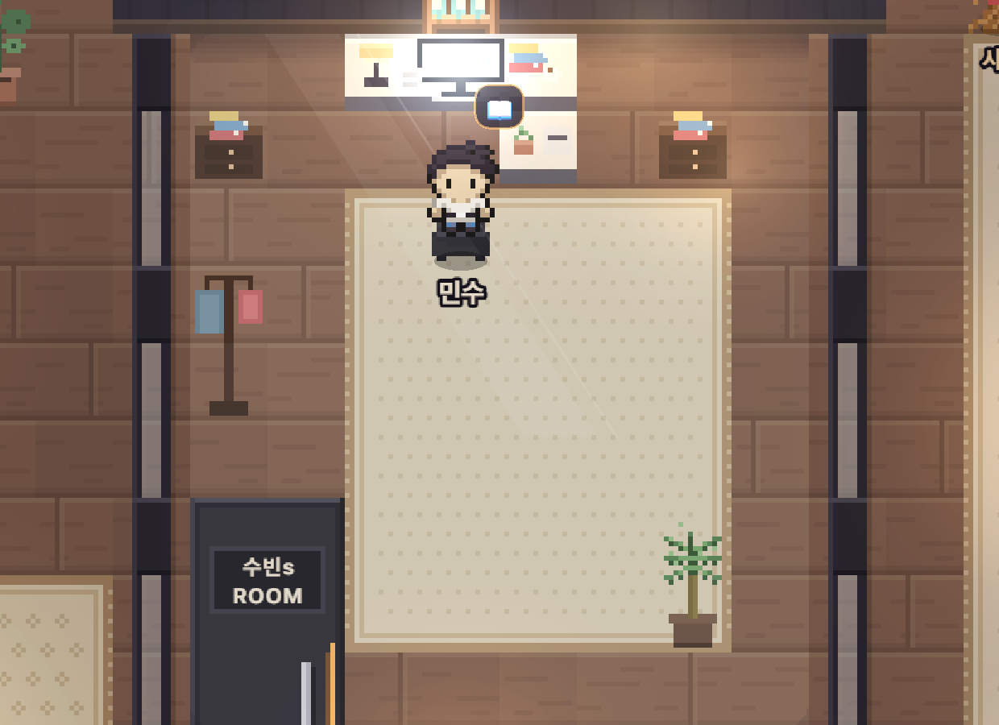

# 📚 Null Study Meta

2D 탑뷰 멀티플레이 **스터디 메타버스**. 밤의 아늑한 스터디 카페 "우리의 스터디룸"에서 같이 공부하는 공간을 만듭니다.

> **현재 단계: 5단계 — 아바타 커스터마이징.** 닉네임으로 입장해 다른 접속자와 같은 방을 걸어다니고(서버 이동 검증),
> 의자·푸프·소파에 앉고(E), 채팅·이모지·공부/휴식 상태를 공유하고 각자 뽀모도로를 돌립니다. 끊겨도 30초 안에 같은 세션으로 이어집니다.
> 라운지의 갈색 푸들 "사랑" 은 서버가 움직이는 NPC 로, 가까이 가면 쳐다보고 E 로 쓰다듬을 수 있습니다.
> 3단계에서는 목업처럼 두께감 있는 유리 스터디룸·슬라이딩 문으로 맵을 정리하고, 책상에 앉으면 모니터가 켜지고,
> 커피머신 앞에서 E 로 ☕ 휴식, 창밖은 실제 시각에 따라 낮/노을/밤으로 바뀌며, 뽀모도로 전환 연출과 유튜브 카드가 붙었습니다.
> 4단계에서는 "앉아서 공부 중"인 시간이 **공부 세션**으로 Supabase(없으면 메모리)에 저장되고, 출석 스트릭·오늘 목표(책상 앞 팻말 + 진행 바)·
> 랭킹(오늘/이번 주)·서버 저장 할 일(어제 것은 이월)이 생겼습니다.
> 5단계에서는 캐릭터가 **피부·머리(12종)·상의(5종)·하의·신발·안경(3종)** 레이어로 나뉘고 색을 팔레트로 고를 수 있습니다.
> 입장 화면과 설정의 아바타 빌더에서 고르면 `users.avatar` 에 저장되고 방 안 모두에게 즉시 반영됩니다.







| 낮 (06~17시) | 노을 (17~19시) | 밤 (19~06시) |
|---|---|---|
|  |  |  |



## 기술 스택

| 영역 | 사용 기술 |
|---|---|
| 런타임 | Node.js 24 (`.node-version`), 최소 22 (`engines`) |
| 서버 | Express (정적 파일 + `/healthz` + `/api/rooms/studyroom`) + Socket.io (`server/socket.js`) |
| 클라이언트 | Phaser 3.87 (CDN), 순수 HTML/CSS/JS — **빌드 도구 없음** |
| 저장소 | Supabase (`SUPABASE_URL` + `SUPABASE_SERVICE_KEY`), 키가 없으면 **메모리 저장소로 자동 폴백** |
| 에셋 도구 | Python 3 + Pillow (아틀라스/캐릭터 빌드, 리컬러). 빌드 결과물은 커밋되므로 실행 시에는 필요 없음 |

## 폴더 구조

```
null-study-meta/
├── CLAUDE.md                 # 작업 규칙 (스택 고정, 테스트는 STORE=memory 강제, 에셋 라이선스 등)
├── package.json              # start / dev / test / build:assets
├── .node-version             # 24
├── .env.example              # 환경변수 템플릿 (.env 로 복사)
├── render.yaml               # Render free 플랜 Blueprint (NODE_VERSION=24, healthCheck /healthz)
├── design/studyroom.png      # 목업 (방 배치·색감 기준)
├── supabase/schema.sql       # 영구 데이터 스키마 + 집계 SQL 함수 (여러 번 실행 안전, RLS on · 정책 없음)
├── server/
│   ├── index.js              # Express 부트스트랩, /healthz, /api/rooms/studyroom, /api/oembed(유튜브 제목 프록시), Socket.io 부착, SIGTERM 시 세션 저장
│   ├── socket.js             # 소켓 프로토콜 배선 (join/move/sit/status/interact/listening/chat/emoji/pomodoro/profile:reset/time:ping/leave/npc:*)
│   ├── game/
│   │   ├── world.js          # 방 실시간 상태: 플레이어·세션 토큰·좌석 점유·상태(공부/휴식/☕)·상호작용·듣는 중·유예 정리 (순수 로직)
│   │   ├── movement.js       # 발 박스 충돌 + "경과 시간 × 최대 속도 × 1.5" 이동 예산 검증
│   │   ├── nickname.js       # 닉네임 규칙(문자·숫자·공백·_- 12자) + 중복 시 "이름2"
│   │   ├── chat.js           # 200자·HTML 이스케이프·300ms 도배 방지
│   │   ├── pomodoro.js       # 개인 뽀모도로 (기본 25/5, 집중 20~90·휴식 5~20분, 자동 전환, 서버 시각 기준)
│   │   ├── study.js          # 공부 세션(앉아서 공부 중, 60초 미만 폐기) · 출석 · 오늘 목표 달성 · 랭킹 통계 (저장소 인터페이스만 사용)
│   │   └── npc.js            # 강아지 NPC: 어슬렁/앉기/자기/산책 상태기계, BFS 경로(충돌 준수), 쳐다보기, 쓰다듬기 쿨다운, 이름
│   ├── rooms/
│   │   ├── build.js          # RoomBuilder: tiles.json 기준으로 레이어 배열 + 충돌/의자/문/조명/창문/구역/화면/상호작용 지점 생성
│   │   └── studyroom.js      # "우리의 스터디룸" 46x34 타일 정의 (3단계: 유리 스터디룸·식물 정리·수납장/선반 채우기)
│   └── store/                # index.js(선택/폴백), memory.js, supabase.js (같은 인터페이스), stats.js(시간대·주 시작·스트릭 규칙 공용)
├── public/
│   ├── index.html, css/style.css
│   ├── js/main.js            # 부트스트랩: 방 데이터 fetch → Phaser 생성 → Net·UI·씬·FX 연결, 입장/재입장 흐름
│   ├── js/net.js             # 소켓 래퍼: join/재접속(세션 토큰 localStorage), 서버 시각 동기화, 20Hz 이동 전송
│   ├── js/ui.js              # HUD(방 이름·인원·뽀모도로 배지·설정·멤버·알림·♪·넓게 보기·나가기) + 사이드바(접을 수 있는 카드: 미니맵·오늘의 목표·할 일·뽀모도로·랭킹·유튜브·채팅) + 토스트·입장/초기화 모달 + 아바타 빌더(AvatarBuilder)
│   ├── js/avatar-schema.js   # 아바타 값 검증 (catalog 기준, 서버와 같은 파일을 require)
│   ├── js/avatar.js          # AvatarKit: catalog + 레이어 PNG 로드, 팔레트 리컬러, 레이어 합성 시트/프레임 그리기
│   ├── js/daylight.js        # 시간대 가중치(낮/노을/밤, 경계 30분) + 하늘 팔레트 + 실내 연출 강도 (순수 함수, 테스트 공용)
│   ├── js/music.js           # 유튜브 URL 파싱 · 최근 5개 (순수 함수, 테스트 공용)
│   ├── js/fx.js              # Web Audio 합성 알림음 + 브라우저 알림 도우미
│   ├── js/scenes/RoomScene.js# 타일맵(floor/furniture/windowDay/top), 아바타, 하늘 그라데이션·별, 유리 구역 틴트·밝기, 화면 on/off, 상호작용 지점, 조명·플래시
│   └── assets/               # tiles.png / tiles.json (아틀라스), dog.png / dog.json, avatar/ (catalog.json + 레이어별 PNG), player.png / player.json(옛 단일 시트, 빌드 산출물), CREDITS.txt
├── tools/
│   ├── fetch_assets.py       # 외부 에셋 원본 다운로드 → tools/raw/ (git 제외)
│   ├── build_assets.py       # 아틀라스 + 캐릭터 시트 빌드 (16px 논리 → 32px, nearest)
│   ├── avatar_parts.py       # 5단계: 캐릭터 시트를 레이어로 분리 + 머리/상의/안경 드로잉 → public/assets/avatar/
│   ├── recolor.py            # 팔레트 리컬러 (Kenney 원색 → 목업의 따뜻한 파스텔/우드 톤)
│   ├── pixel.py              # 픽셀 드로잉 도우미 + 3x5 픽셀 폰트
│   ├── props.py, props_room.py, props_v2.py, props_v3.py # 팩에 없는 소품을 코드로 그림 (창문 밤/낮, 보드, 소파, 유리 파티션·슬라이딩 문, 수납장 …)
│   ├── dog_sprite.py         # 강아지 NPC 시트 (푸들 머리 + 직접 그린 4방향 걷기 2프레임·앉기(꼬리 2종)·자기 2프레임)
│   ├── render_map.py         # 서버 방 데이터를 PNG 로 합성 (배치/충돌 검수)
│   ├── screenshot.js         # puppeteer-core 로 게임 스크린샷 (2탭 접속 / 채팅 / 착석 / 전체 맵)
│   ├── screenshot_stage3.js  # 3단계 검수 컷: 낮/노을/밤, 스터디룸 확대(모니터 켜짐), 커피, 전체 맵
│   ├── compare_mockup.py     # 목업 | 게임 나란히 (screenshots/compare_mockup.png)
│   └── lib/walk.js           # 헤드리스 브라우저에서 키보드로 한 타일씩 걷기 (테스트·스크린샷 공용)
├── test/                     # node:test — setup.js 가 STORE=memory 강제 (단위 · 소켓 E2E · 지연 프록시 · 헤드리스 2탭)
└── screenshots/              # compare_mockup.png (목업 vs 게임), s3_day/sunset/night.png, s3_study_zoom.png, s3_coffee.png
```

## 로컬 실행

```bash
npm install          # Node 22+ (권장 24)
npm start            # http://localhost:3000  (개발 중 자동 재시작: npm run dev)
```

브라우저 탭을 두 개 열어 서로 다른 닉네임으로 입장하면 같은 방에서 만납니다.

| 조작 | 키 |
|---|---|
| 이동 | 방향키 / WASD (벽·가구·유리벽·화분 통과 불가, 유리 스터디룸은 미닫이문으로만) |
| 앉기 / 일어나기 | 의자·푸프·소파 옆에서 **E** (좌하단에 힌트가 뜸). 앉으면 자동으로 "공부 중" |
| 강아지 쓰다듬기 | 강아지 옆에서 **E** (더 가까운 쪽이 우선). 머리 위 ❤️ 1초 + 채팅 알림, 3초 쿨다운. 이름은 설정에서 변경(기본 "사랑", 모두에게 적용) |
| 채팅 | **Enter** 로 입력창 포커스 → Enter 전송, **Esc** 로 나가기. 입력 중엔 게임 키가 막힘 |
| 이모지 | **1 ~ 6** (좌하단 바 클릭도 가능). 머리 위 2초 |
| 상태 전환 | 좌하단 "공부 중 / 휴식 중" 버튼. 아바타 머리 위 📖 / ☕ |

- 화면: 좌상단 방 이름·인원, 우상단 설정(셔츠 색·닉네임 변경)·멤버·알림·나가기, 오른쪽 360px 사이드바에
  미니맵 · 오늘의 목표 · 오늘의 할 일 · 내 뽀모도로(집중/휴식 분 설정, 자동 전환, 서버 시각 기준) · 랭킹 · 채팅. 카드마다 접기/펼치기(상태 기억).
- 캔버스는 사이드바를 뺀 영역에 꽉 차고(`Scale.RESIZE`) 카메라 줌 2배로 내 아바타를 따라갑니다. `pixelArt: true`.
- 재접속: 입장 시 받은 세션 토큰을 localStorage 에 두고, 끊기면 "재접속 중" 배너 → 같은 토큰으로 기존 플레이어를 이어받습니다
  (30초 유예). 서버가 재시작됐으면 저장된 닉네임·셔츠 색으로 새로 입장합니다.
- 다른 포트: `PORT=8080 npm start` (PowerShell: `$env:PORT=8080; npm start`).

### 테스트

```bash
npm test
```

`test/setup.js` 가 테스트 프로세스에 `STORE=memory` 를 강제하고 `SUPABASE_*` 를 제거하므로 **실제 Supabase 로 절대 나가지 않습니다.**

| 파일 | 내용 |
|---|---|
| `game.test.js` | 단위: 닉네임 규칙/중복, 이동 예산(정상 속도 허용·순간이동 거부·벽), 채팅 이스케이프/도배, 뽀모도로 자동 전환, 월드(좌석 점유·상태 복귀·유예 재접속) |
| `stage7.test.js` | 7단계: 뽀모도로 configure 범위(20~90/5~20)·진행 중 거부, 월드 개인 타이머(따로 돌고·시작 때 설정·퇴장 정리·재접속 유지), 기록 초기화(메모리 저장소 resetUser 는 세션·출석·목표·할 일만, StudyTracker.reset 은 진행 중 세션 폐기, World.resetProfile 토큰·닉네임 확인), 소켓 `profile:reset` E2E(거부·삭제·playerGoal null·leaderboard:refresh·랭킹 0), 브라우저(카드 접기 새로고침 유지·채팅 높이·뽀모도로 입력 범위/잠김·줌 2.5 텍스트 해상도·넓게 보기 캔버스 전체·초기화 모달 닉네임 확인) |
| `study.test.js` | 4단계: 날짜 규칙(시간대 0시·월요일 주 시작·세션은 시작 날짜), 출석 스트릭(경계일·끊김·주 경계), 메모리 저장소(세션·출석·목표·할 일 이월·강아지 이름), 세션 규칙(60초 폐기·휴식/커피 전환·일어나기·퇴장·재접속 유지·종료 저장), 출석 이벤트, 목표 달성(검증·한 번만·다음 날 리셋), 랭킹 통계, 저장소 폴백·인터페이스 동일성, 소켓 E2E(프로필·playerGoal·leaderboard:refresh·attendance·goalReached·할 일 CRUD·강아지 이름 저장) |
| `stage3.test.js` | 3단계: 커피머신 상호작용(거리·토글·앉으면 공부→일어나면 휴식), 듣는 중 제목, 소켓 `interact`/`listening` 브로드캐스트, oEmbed 프록시(가짜 fetch·캐시, 네트워크 없음), 시간대 가중치(경계 30분·합 1·팔레트), 유튜브 URL 파싱·최근 5개 |
| `npc.test.js` | 강아지: 결정적 난수로 20분 돌려도 막힌 칸에 안 들어감·모든 상태 순환·산책, 틱당 이동량, 쳐다보기, 쓰다듬기 쿨다운, 이름 규칙 + 소켓: 두 클라이언트가 같은 `npc:update` 를 받음, 쓰다듬기/이름 브로드캐스트 |
| `socket.test.js` | 소켓 E2E: 입장/중복 닉네임, playerMoved 가 발신자에게 안 감, move:correct 는 본인에게만, 착석/상태/아바타, 채팅/이모지, 개인 뽀모도로(내 것만 받음·각자 따로), 토큰 재접속·옛 소켓 정리·유예 만료 |
| `gate.test.js` | 6단계: 게이트 단위(비활성 통과·빈 값·틀림/맞음·5회 → 잠금·시간 경과 후 해제·성공 시 초기화·긴 값·IP 분리·X-Forwarded-For 키·평문 미로그), 서버 E2E(`/api/config`·`password_required`·`wrong_password remaining`·`locked retryAfterMs`·정상 입장·살아 있는 토큰 재접속은 비밀번호 없이·재시작 후엔 다시 필요·로그에 평문 없음), 브라우저(비밀번호 칸 표시·틀림 → 에러·맞음 → 입장·`nsm.password` 기억·새 탭 자동 입장) |
| `avatar.test.js` | 5단계: 카탈로그(머리 ≥10·상의 5·안경 3·색 6/10/12/8/6, 톤 수 = 팔레트 수), 검증(없는 id·잘못된 값 → 기본값, 옛 정수/`{shirt}` → 상의 색, 여분 필드 제거), `users.avatar` 저장/아바타 미전송 재입장 복원, `avatar:update` ack·본인 포함 브로드캐스트, 모든 레이어 PNG 존재 + 128×256(32×64 ×4×4) 규격 |
| `latency.test.js` | TCP 지연 프록시(편도 300ms)로 두 명이 20Hz 이동 → 거부 0건, 상대·서버·새 입장자 모두 같은 최종 위치 |
| `browser.test.js` | 헤드리스 Chrome 2탭(B 는 300ms 지연): 입장 → 키보드 이동이 상대 화면에 같은 위치 → 채팅(입력 중 이동 차단, HTML 미렌더) → 이모지 → 소파까지 걸어가 E 착석 → 강아지 옆까지 걸어가 E 쓰다듬기(두 탭 ❤️·채팅·같은 위치) → 책상 착석 시 두 탭 모두 모니터 켜짐/일어나면 꺼짐 → 커피머신까지 걸어가 E ☕ 휴식(상대 멤버 목록 반영) → 시각 고정으로 낮/노을/밤 전환·항상 밤 → 시스템 메시지 ×N → localStorage 할 일 서버 이전 → 목표 저장이 상대 화면 팻말에 → 출석 토스트·목표 달성 🎉·시스템 채팅 → 랭킹 카드(시간·🔥·메모리 배지) → 아바타 꾸미기 모달에서 단발·핑크 선택이 상대 화면에 즉시 반영·localStorage 저장 → 소켓 강제 종료 후 이어받기 → 나가기. Chrome 이 없으면 건너뜀 (`CHROME_PATH`) |
| `room.test.js`, `server.test.js`, `store.test.js` | 방 데이터·충돌·도달성, 유리 스터디룸 타일 구성·문·구역·화면·상호작용 지점·식물 수·낮 창문 레이어, HTTP 엔드포인트·socket.io 클라이언트 서빙, 저장소 폴백 |

## 소켓 프로토콜

클라이언트 → 서버는 ack 콜백으로 결과를 받습니다. 서버 → 클라이언트 알림은 이름 그대로 브로드캐스트됩니다.

| 클라이언트 → 서버 | ack / 결과 |
|---|---|
| `join { nickname, token?, avatar?, password? }` | `{ ok, resumed, token, self, players, seats, pomodoro, config, serverTime }` — `token` 이 살아 있으면 기존 플레이어를 이어받고 옛 소켓은 즉시 끊음. `avatar` 를 안 보내면(새 브라우저) `users.avatar` 에서 복원. `ROOM_PASSWORD` 가 켜져 있으면 `password` 필수 — 거부 시 `{ ok:false, error: password_required \| wrong_password, remaining \| locked, retryAfterMs }` (살아 있는 토큰으로 이어받을 땐 안 물음) |
| `move { x, y, facing, moving }` (20Hz, volatile) | 통과 시 다른 사람에게만 `playerMoved`. 거부(예산 초과·벽·착석 중) 시 **본인에게만** `move:correct { x, y, reason }` |
| `sit { seatId }` / `stand` | 점유·거리(56px) 검사 → 모두에게 `playerSat` / `playerStood` |
| `status { study \| rest }` | `playerStatus` |
| `avatar:update { avatar }` | `{ ok, avatar }` (catalog 기준으로 정규화된 값) → **본인 포함** 모두에게 `avatar:update { id, avatar }`. 옛 정수 아바타(0..3)도 받아 상의 색으로 옮김 |
| `interact { id }` | 상호작용 지점(`room.interactables`) 거리 검사. `coffee` 면 상태 `coffee`(☕ 휴식) ↔ `rest` 토글 → 모두에게 `playerStatus`. 앉으면 공부 중, 일어나면 휴식(커피 아님) |
| `listening { title \| null }` | 유튜브 재생 중 제목(≤80자) → 모두에게 `playerListening { id, listening }` (닉네임 옆 ♪, 멤버 목록 "듣는 중") |
| `stats` | `{ ok, store, tz, date, rows: [{ nickname, todaySeconds, weekSeconds, streak, weekDays, live, online }] }` — 진행 중 세션 초 포함, 서버 3초 캐시. 클라이언트는 5초 폴링 + `leaderboard:refresh` |
| `goal:set { text ≤20자, targetMinutes 30~480(30단위) }` | `{ ok, goal, reached }` → 모두에게 `playerGoal { id, goal }` (앉으면 팻말) |
| `todo:list` / `todo:add { text }` / `todo:toggle { id, done }` / `todo:delete { id }` | 본인 닉네임의 할 일. 목록은 미완료 전부 + 오늘 완료한 것, 어제 이전 미완료는 `carried: true`(이월) 로 맨 위 |
| `chat { text }` | 200자·이스케이프·300ms 검사 → 모두에게 `chat { id, nickname, text, ts }` |
| `emoji { index 0..5 }` | `playerEmoji { id, emoji }` |
| `pomodoro:start { focusMinutes?, breakMinutes? }` / `pomodoro:stop` | **개인 타이머** (7단계). ack `{ ok, ...snapshot }` 또는 `{ ok:false, error: running \| not_running \| invalid_focus \| invalid_break }`. 집중 20~90분 · 휴식 5~20분(정수), 진행 중엔 설정 변경 불가. 자동 전환 때 **본인에게만** `pomodoro { running, phase, startedAt, endsAt, startedBy, focusMs, breakMs, serverTime }` |
| `profile:reset { nickname, token }` | 내 기록 초기화 (7단계): 세션 토큰·닉네임이 모두 맞아야 `{ ok, counts: { sessions, attendance, goals, todos } }`, 아니면 `confirm_mismatch`. 공부 세션·출석·오늘 목표·할 일 삭제(아바타·강아지 이름 유지), 진행 중 세션은 버리고 앉아 있으면 새로 센다 → 모두에게 `playerGoal { id, goal: null }` + `leaderboard:refresh` |
| `time:ping { t0 }` | `{ t0, serverTime }` — 클라이언트가 왕복/2 를 빼서 시계 차이를 맞춤 |
| `leave` | 즉시 정리 → `playerLeft` |
| `npc:pet { id }` | 거리(56px)·3초 쿨다운 검사 → `npc:pet { id, by, playerId }` + 시스템 `chat { system: true, text }` |
| `npc:name { id, name }` | 문자·숫자·공백·_- 8자 → `npc:name { id, name }` |

강아지 NPC 는 서버가 행동을 정합니다 (`server/game/npc.js`): 라운지 러그 주변 어슬렁(40px/s) → 앉기 → 쿠션(24,9)에서 자기 → 가끔 방 안 산책(60px/s) 후 복귀.
이동은 타일 중심을 잇는 BFS 경로라 벽·가구를 지키고(쿠션 타일만 예외), 플레이어와는 겹칩니다. 플레이어가 48px 안에 오면 멈춰서 그쪽을 보고 꼬리를 흔듭니다(`look`).
`npc:update { id, kind, name, x, y, facing, state }` 를 걷는 동안 10Hz, 그 외엔 바뀔 때 + 1초 키프레임으로 보내고, 클라이언트는 100ms 늦게 선형 보간합니다. 입장 ack 의 `npcs` 에 현재 스냅샷이 들어 있습니다.

그 밖에 `playerJoined`, `playerLeft { id, nickname, reason }`, `playerDisconnected`, `playerReconnected`, `roomCount { count }`,
`leaderboard:refresh { nickname, seconds }`(세션 저장 시), `attendance { streak, weekDays }`(본인, 출석 기록 시), `goalReached { id, nickname }` + 시스템 `chat`.
입장 ack 에는 `profile { goal, streak: { streak, weekDays, attendedToday } }`, `store`, `tz` 가 함께 옵니다 (오늘 출석했으면 "N일 연속 출석 🔥" 토스트).
HTTP: `GET /api/oembed?url=…` 은 유튜브 주소만 받아 서버가 oEmbed 제목을 대신 가져옵니다(10분 캐시, 브라우저 CORS 우회). 테스트는 fetch 를 주입해 네트워크를 쓰지 않습니다.
`GET /api/config` → `{ passwordRequired }` 로 클라이언트가 입장 화면에 비밀번호 칸을 보일지 정합니다 (값은 내려가지 않음).

이동 검증은 **예산 방식**입니다: 마지막 이동 이후 경과 시간 × 최대 속도(150px/s) × 1.5 만큼 예산이 쌓이고(상한 0.5초치),
이동 거리만큼 소모합니다. 지연으로 패킷이 몰려 와도 통과하고, 순간이동은 거부됩니다. 거부되면 클라이언트는 순간이동 없이 서버 위치로 부드럽게 수렴합니다.
원격 아바타는 받은 스냅샷을 100ms 늦게 두 점 사이 **선형 보간**으로 그립니다.

## 공부 기록 (4단계)

- **세션** = "자리에 앉아 있고 상태가 공부 중"인 구간 (`server/game/study.js`). 일어나기·휴식/커피 전환·퇴장(유예 만료 포함)·서버 종료(SIGTERM) 때 저장하고
  **60초 미만은 폐기**합니다. 연결이 끊겨도 30초 유예 동안 자리는 유지되므로 재접속하면 세션이 이어집니다. 저장되면 `leaderboard:refresh`.
- **출석**: 하루 첫 세션이 저장되는 순간 또는 진행 중 세션이 1분을 넘는 순간 `attendance(nickname, date)` 기록. 스트릭은 오늘 출석했으면 오늘부터,
  아니면 어제부터 거슬러 센 연속 일수(하루가 지나기 전엔 끊기지 않음). 이번 주 출석 일수는 월요일부터.
- **오늘 목표**: 한 줄(20자) + 목표 시간(30분~8시간, 30분 단위) → `daily_goals`. 앉으면 발 아래 팻말에 목표 텍스트(말줄임)와 진행 바(오늘 누적/목표).
  공부 중 누적이 목표에 닿는 순간 머리 위 🎉 3초 + 시스템 채팅 "OOO님이 오늘 목표를 달성했어요 🎉" + 차임. 같은 목표는 하루 한 번, 이미 넘긴 목표를 다시 저장하면 조용히 달성 처리.
- **랭킹**: 오늘/이번 주 탭, 진행 중이면 초록 점, 🔥N 스트릭, 내 행 강조, 하단에 저장소 표시(☁ Supabase / ⚠ 메모리).
- **할 일**: 서버 `todos` 에 저장. 완료 체크 시 `done_at`. 어제 이전에 만든 미완료는 "이월" 배지로 오늘 목록 맨 위. 3단계까지의 localStorage 할 일은 첫 접속 때 자동으로 옮깁니다.
- **시간대**: `STATS_TZ`(기본 `Asia/Seoul`) 기준 0시·월요일. 세션은 시작 시각의 날짜로 집계. 메모리 저장소(`server/store/stats.js`)와 Supabase SQL 함수가 같은 규칙입니다.
- **저장소**: `server/store/` 의 메모리 구현과 Supabase 구현이 같은 인터페이스(`upsertUser` / `saveSession` / `studyTotals` / `recordAttendance` / `attendanceOf` / `attendanceStats` / `listTodos` … / `getGoal` / `setGoal`).
  `SUPABASE_URL` · `SUPABASE_SERVICE_KEY` 가 없으면 메모리로 폴백(서버 재시작 시 사라짐). 실시간 상태(접속자·좌석·타이머·강아지 위치)는 계속 메모리이고, 강아지 이름은 `users.dog_name` 에 마지막 변경값을 저장해 시작 시 복원합니다.

### Supabase 설정

1. Supabase 프로젝트 → SQL Editor 에서 [`supabase/schema.sql`](supabase/schema.sql) 실행 (여러 번 실행해도 안전).
   테이블 `users` · `study_sessions` · `todos` · `daily_goals` · `attendance` 와 집계 함수 `study_totals(tz)` · `attendance_streaks(tz, only_nickname)` · `list_todos(nickname, tz)` 가 생깁니다.
   모든 테이블은 RLS 가 켜져 있고 정책이 없으며 함수도 anon/authenticated 에서 실행을 막아 두어, **service_role 키를 가진 서버만** 접근합니다.
2. `.env` 에 `SUPABASE_URL`, `SUPABASE_SERVICE_KEY`(service_role) 를 넣고 서버를 시작하면 로그에 `store=supabase` 가 찍힙니다. 연결에 실패하면 경고 후 메모리로 폴백합니다.

## 방 비밀번호 (6단계)

`ROOM_PASSWORD` 환경변수를 넣으면 방 전체에 비밀번호가 걸립니다 (`server/gate.js`).

- 서버는 시작할 때 무작위 솔트로 **scrypt 해시**만 들고 있고, 입장 때 받은 값을 같은 방식으로 해시해 `timingSafeEqual` 로 비교합니다. 평문은 로그·ack·월드 어디에도 남기지 않습니다 (로그엔 `password=on/off` 와 실패 횟수·IP 만).
- 클라이언트(IP, 프록시 뒤에서는 `X-Forwarded-For` 첫 IP)별로 **5회 연속 실패 → 30초 잠금**. 잠긴 동안은 `locked { retryAfterMs }` 로 즉시 거부되고, 입장 화면은 남은 초를 세며 버튼을 막습니다. 맞추면 실패 횟수가 초기화됩니다.
- 입장 화면은 `GET /api/config` 의 `passwordRequired` 를 보고 비밀번호 칸을 보입니다. **맞춘 값은 `localStorage`(`nsm.password`) 에 기억**해 다음 접속·재연결 때 자동으로 보내고, 틀리면 지웁니다. 살아 있는 세션 토큰으로 이어받는 재접속은 비밀번호를 다시 묻지 않습니다.
- 비워두면 게이트가 꺼져 지금까지처럼 누구나 입장합니다. 바꾸려면 서버를 재시작합니다.

## 설정·UI (7단계)

- **뽀모도로는 각자**: 카드의 집중(20~90분)·휴식(5~20분) 입력은 `localStorage`(`nsm.pomo`) 에 기억하고 시작할 때 서버로 보냅니다. 서버는 플레이어마다 타이머를 하나씩 들고(재접속 이어받기 유지, 퇴장 시 정리) 자동 전환을 본인에게만 알립니다. 진행 중엔 입력이 잠깁니다.
- **카드 접기/펼치기**: 사이드바 모든 카드 제목 줄의 ⌄ 로 접으면 제목 줄만 남고 `nsm.card.<id>` 에 기억합니다. 채팅 카드는 이전보다 40% 높게(최소 224px). Enter 로 채팅에 들어가면 채팅 카드는 자동으로 펼쳐집니다.
- **내 기록 초기화**: 설정 → "내 기록 초기화" → 모달에 닉네임을 똑같이 입력해야 삭제 버튼이 살아납니다. 서버는 세션 토큰 + 닉네임을 확인한 뒤 공부 세션·출석·오늘 목표·할 일을 지웁니다(아바타·강아지 이름은 유지).
- **화면 크기**: 설정의 작게/보통/크게 = 카메라 줌 1.5/2/2.5 (`nsm.zoom`). 줌을 바꾸면 씬의 모든 텍스트 해상도를 줌과 같게 다시 그려 흐려지지 않습니다.
- **넓게 보기**: 설정 토글 또는 우상단 ⤢ 버튼으로 사이드바를 접고 캔버스가 화면 전체를 씁니다(`nsm.wide`). Enter(채팅)·♪(음악) 을 누르면 사이드바가 다시 펼쳐집니다.

## 아바타 (5단계)

- **레이어**: `body`(피부 + 민머리 두상) → `top`(상의) → `bottom`(하의) → `shoes`(신발) → `hair`(머리) → `acc`(안경). 각 레이어는 `public/assets/avatar/<layer>/<id>.png`
  (4열 걷기 × 4행 down/right/up/left, 32×64 프레임 = 논리 16×32 의 2배)이고 **모든 레이어가 같은 프레임 규격**이라 그대로 겹치면 됩니다.
- **카탈로그** `public/assets/avatar/catalog.json`: 레이어별 아이템(id·표시명)·기준 팔레트·색상 필드, 색상 옵션(id·표시명·`tones`), 기본값, 옛 정수 아바타 → 상의 색 표.
  서버(`server/game/avatar.js`)와 클라이언트가 같은 검증 코드(`public/js/avatar-schema.js`)를 씁니다: 없는 id·잘못된 값은 기본값, 여분 필드는 버림.
- **색**: 레이어 PNG 는 기준 팔레트(예: 머리 `#6a4834 / #432e27 / #8c6a4e` = 기본·어두운·하이라이트)로 저장되어 있고, 클라이언트가 런타임에 픽셀 단위로
  기준 톤 → 고른 색의 `tones` 로 치환합니다(명암 단계 유지). 피부 6 · 머리 10 · 상의 12 · 하의 8 · 신발 6 색. 모자·비니·안경은 고정색.
- **파츠**: 머리 12종(기본·짧은 머리·가르마·곱슬·뾰족머리·단발·장발·포니테일·트윈테일·똥머리·모자·비니), 상의 5종(기본 튜닉·티셔츠·셔츠·후드·니트), 하의(바지), 신발(부츠),
  안경 3종(동그란·각진·선글라스) + 없음. 기본 머리·상의·하의·신발·피부는 원본 시트(`tools/raw/oga_zelda/gfx/character.png`)를 `tools/avatar_parts.py` 가
  **팔레트 + 위치 기준으로 분리**한 것이고(머리 자리는 민머리 두상 템플릿으로 채움), 새 머리·상의 디테일·안경은 같은 스크립트에서 16px 마스크로 그렸습니다
  (오른쪽/아래 가장자리 검정 외곽선, 왼쪽/위는 어두운 톤, 피부에 닿는 가장자리는 부드럽게 — 원본 화풍 규칙).
- **렌더**: `AvatarKit.composeSheet()` 가 레이어 6장을 한 캔버스에 겹치고, 씬은 플레이어마다 캔버스 텍스처 하나(`av:<id>`)를 만들어 파츠가 바뀌면 같은 캔버스를 다시 그려
  `refresh()` 합니다(텍스처 생성/삭제 반복 없음). 스프라이트는 하나이므로 팻말·말풍선·상태 아이콘 위치는 그대로입니다.
- **UI**: 입장 화면의 "아바타" 섹션과 설정 → "아바타 꾸미기" 모달이 같은 빌더 DOM 을 옮겨 씁니다. 좌: 4배 미리보기(걷기 애니메이션, 클릭으로 방향 회전),
  우: 파츠 탭(머리/상의/하의/신발/피부/액세서리) → 썸네일(그 파츠만 바꾼 정면 아바타, 현재 선택 강조) → 색상 원형 버튼, 🎲 랜덤 · 초기화.
- **저장**: `localStorage(nsm.avatar, JSON)` + 서버 `users.avatar`(jsonb). 방 안에서 바꾸면 200ms 디바운스로 `avatar:update` → 모두에게 즉시 반영.
  localStorage 가 비어 있으면(새 브라우저) 입장 시 `avatar` 를 보내지 않아 서버가 저장된 값을 복원합니다. 4단계까지 저장된 정수(셔츠 색)·`{ shirt }` 도 그대로 호환.

```bash
python tools/avatar_parts.py     # public/assets/avatar/*, screenshots/s5_hair_row.png, tools/out/avatar_preview.png (검수용)
node tools/screenshot_stage5.js  # s5_builder.png · s5_builder_top.png · s5_settings.png · s5_room.png (서버 먼저 실행)
```

## 방 데이터 형식 (`GET /api/rooms/studyroom`)

```jsonc
{
  "id": "studyroom", "name": "우리의 스터디룸", "width": 46, "height": 34, "tileSize": 32,
  "layers": { "floor": [[...]], "furniture": [[...]], "windowDay": [[...]], "top": [[...]] },  // 아틀라스 타일 인덱스, 빈 칸 -1
  "collision": [[true, false, ...]],
  "seats": [{ "id": "seat-0", "x": 19, "y": 6, "facing": "down", "kind": "sofa_wide" }],
  "doors": [{ "id": "study1-l", "x": 14, "y": 21, "to": null }],
  "lights": [{ "x": 560, "y": 77, "r": 83, "color": 16758876, "intensity": 0.55 }],  // 픽셀 좌표
  "labels": [{ "x": 240, "y": 128, "text": "Good ... Tomorrow", "font": "hand", "size": 24, "color": "#e8dcc4", ... }],
  "windows": [{ "x": 448, "y": 0, "w": 448, "h": 144 }],                  // 창밖 하늘 사각형 (클라이언트가 시간대 그라데이션)
  "zones": [{ "id": "study1", "kind": "glass", "x": 384, "y": 384, "w": 256, "h": 288, "bright": 0.6 }],  // 유리 스터디룸: 밝게 + 틴트
  "screens": [{ "seatId": "seat-8", "kind": "monitor", "x": 480, "y": 388, "w": 32, "h": 14 }],           // 좌석 점유 시 켜지는 화면
  "interactables": [{ "id": "coffee", "kind": "coffee", "x": 208, "y": 512, "hint": "커피 마시기", "range": 56 }],
  "spawn": { "x": 720, "y": 768 }
}
```

- `server/rooms/studyroom.js` 는 `RoomBuilder` 로 오브젝트를 타일 좌표에 놓기만 하고, 레이어 배열·충돌·좌석·문은
  `public/assets/tiles.json` 의 오브젝트 정의(크기, `layer`, `solid`, `top` 행 수, `seats`, `door`)에서 자동으로 만들어집니다.
- 화분 윗부분, 스탠드 램프 갓, 가로등 머리, 창가 덩굴처럼 **아바타 앞에 와야 하는 것은 `top` 레이어**(통과 가능)로 갑니다.
- 클라이언트는 이 배열을 그대로 Phaser 타일맵 레이어로 그립니다 (클라이언트에 맵 하드코딩 없음). `windowDay` 는 낮 창문 타일로, 시간대 가중치만큼 알파를 올려 밤 창문 위에 겹칩니다.

## 비주얼

- **색감**: 따뜻한 원목 바닥, 어두운 차콜 벽, 앰버 조명, 짙은 초록 식물. Kenney 팩의 채도 높은 주황/초록은 `tools/recolor.py` 로 변환.
- **조명**: 실내는 밝게 두고(어둠 오버레이 20%), 램프·펜던트 주변을 라이트 마스크로 지우고 앰버 글로우(가산 합성, 천천히 흔들림)를 올려
  "밝은 데 더 따뜻한 조명" 느낌. 밤 분위기는 CSS 비네팅과 창밖으로만 냅니다. 조명 위치는 방 데이터의 `lights`.
- **창문 / 시간대**: 창문 타일의 하늘은 투명이고, 클라이언트가 `windows` 사각형에 **실제 시각 기준** 그라데이션을 그립니다
  (`public/js/daylight.js`: 06~17시 낮 하늘색·건물 밝음·불빛 적음, 17~19시 노을 주황→보라, 19~06시 밤. 경계마다 30분에 걸쳐 섞음).
  밤 건물(3프레임 깜빡임)은 `furniture` 레이어, 낮 건물은 `windowDay` 레이어에서 알파로 교차하고, 별은 밤 가중치만큼만 보입니다.
  실내 어둠 오버레이(20% → 낮 6%)와 앰버 글로우도 낮엔 약해집니다. 설정의 "창밖 항상 밤으로 고정" 으로 끌 수 있습니다.
- **유리 스터디룸**: 벽은 8px 차콜 프레임 띠 — 3타일마다·모서리·문 옆은 통짜 기둥(위·왼쪽 하이라이트, 오른쪽·아래 그림자)이고
  그 사이는 반투명 하늘빛 유리 판이라 바닥이 비칩니다. 안쪽(`zones`)은 어둠 레이어를 더 지워 다른 구역보다 밝고, 옅은 하늘빛 틴트와
  창가 쪽 사선 반사 한 줄을 올립니다. 슬라이딩 문은 프레임과 같은 톤의 2×4 패널(세로 손잡이·앰버 라인·이름 플라크), 열린 자리 2타일은 바닥 레일 + 앰버 조명.
- **화면 켜짐**: `screens` 의 좌석이 점유되면(서버 `playerSat`/`playerStood`/입장 ack `seats` 기준) 모니터·노트북 화면이 밝아지고 푸른 글로우가 켜집니다.
- **뽀모도로 전환**: 집중↔휴식 때 Web Audio 로 합성한 3음 차임(파일 없음, 설정에서 끔) + 창문·펜던트 글로우가 1초 밝아졌다 돌아오고,
  권한이 있으면 브라우저 알림. 좌상단 배지에 남은 시간이 뜹니다.
- **유튜브 카드**: "Music Always Helps" 패널 앞 E 또는 우상단 ♪ → 사이드바에 IFrame API 플레이어. 영상/재생목록 URL, 최근 5개(localStorage),
  재생/일시정지, 접기. 소리는 본인에게만 나고, 재생 중이면 닉네임 옆 ♪ + 멤버 목록에 "듣는 중: 제목"(oEmbed). 자동재생은 재생 버튼을 누른 뒤에만.
- **글자**: 칠판·보드·표지판 글자는 타일에 굽지 않고 `labels` 로 내려 Phaser 텍스트로 그립니다.
  손글씨는 [Gaegu](https://fonts.google.com/specimen/Gaegu), 산세리프는 [Pretendard](https://github.com/orioncactus/pretendard) (둘 다 OFL, CDN 로드).
- **바닥/벽**: 널빤지 3톤 + 이음새 바닥(3단계에서 채도를 낮추고 한 톤 깊은 갈색으로), 벽 상단 몰딩 띠 + 벽 아래 그림자 한 줄, 테두리·패턴(격자/도트/다이아) 러그.
- **식물**: 창가 양끝·스터디룸 각 1·커피 코너 1·입구 양옆·회의 구역 모서리만 남기고(10개), 빈 자리는 액자·벽 선반·수납장·코트 걸이·러그 확장으로 채웠습니다. 벽 덩굴은 창문 좌우에만.

## 에셋

원본은 `tools/raw/` (git 제외)에 두고, 가공본만 `public/assets/` 에 둡니다. 출처·제작자·라이선스는
[`public/assets/CREDITS.txt`](public/assets/CREDITS.txt).

| 용도 | 에셋 | 라이선스 |
|---|---|---|
| 의자·카운터·액자·작은 화분 | Kenney *Roguelike Indoors* | CC0 |
| 캐릭터(치비 16×32, 4방향 4프레임 걷기) — 아바타 기본 파츠(피부·기본 머리·튜닉·바지·부츠)의 원본 | ArMM1998 *Zelda-like tilesets and sprites* (OpenGameArt) | CC0 |
| 아바타 추가 파츠 (머리 11종·상의 디테일 4종·안경 3종·민머리 두상) | 이 저장소 오리지널 (`tools/avatar_parts.py`, 원본 화풍 규칙으로 코드 드로잉) | 프로젝트 라이선스 |
| 강아지 NPC (16×24, 걷기 4방향×2·앉기·자기) | 이 저장소 오리지널 (`tools/dog_sprite.py`, 쿠션 위 푸들 그림 기준) | 프로젝트 라이선스 |
| 나머지 대부분 (바닥·벽·창문 밤/낮·보드·소파·유리 파티션·슬라이딩 문·수납장·커피머신·벤치 …) | 이 저장소에서 코드로 그린 오리지널 | 프로젝트 라이선스 |

다시 빌드하려면 (Python 3.9+, Pillow):

```bash
python tools/fetch_assets.py     # 원본 다운로드
python tools/build_assets.py     # public/assets/tiles.png, tiles.json, player.png, player.json
python tools/dog_sprite.py       # public/assets/dog.png, dog.json (원본 다운로드 불필요)
python tools/avatar_parts.py     # public/assets/avatar/ (catalog.json + 레이어 PNG) — 원본 character.png 필요
```

## 환경변수

| 이름 | 기본값 | 설명 |
|---|---|---|
| `PORT` | `3000` | HTTP 포트 (Render 가 자동 주입) |
| `STORE` | (자동) | `memory` 또는 `supabase`. 비워두면 Supabase 키가 있을 때 `supabase`, 없으면 `memory` |
| `SUPABASE_URL` | – | Supabase 프로젝트 URL |
| `SUPABASE_SERVICE_KEY` | – | Supabase **service_role** 키 (서버 전용, 클라이언트 노출 금지) |
| `STATS_TZ` | `Asia/Seoul` | 통계 시간대 (오늘/이번 주/출석의 0시·월요일 기준) |
| `ROOM_PASSWORD` | – | 방 전체 비밀번호 (6단계). 비워두면 누구나 입장 |

## Render 배포 (Free)

`render.yaml` 이 있어 **New + → Blueprint** 로 배포합니다. `NODE_VERSION=24`, `healthCheckPath: /healthz`,
`SUPABASE_URL` / `SUPABASE_SERVICE_KEY` / `ROOM_PASSWORD` 는 `sync: false` 라 대시보드에서 입력합니다 (Supabase 키를 안 넣으면 메모리 저장소, 비밀번호를 안 넣으면 누구나 입장). `STATS_TZ` 는 `Asia/Seoul`.
Free 플랜은 15분 무요청 시 잠들고, 재시작 시 메모리 상태가 초기화됩니다.

검수 스크린샷을 다시 찍으려면 서버를 띄운 뒤:

```bash
node tools/screenshot_stage3.js http://localhost:3000 screenshots   # 낮/노을/밤, 스터디룸 확대, 커피, 전체 맵
python tools/compare_mockup.py                                        # screenshots/compare_mockup.png
```

## 다음 단계

- 뽀모도로 회차 기록, 주간 리포트
- 유리문/입구 `doors` 로 방 이동, 실외 연결
- 앉은 자세 프레임, 아바타 파츠 확장(치마·가방·모자 색)
- 강아지 상호작용 확장 (간식 주기, 따라오기)
